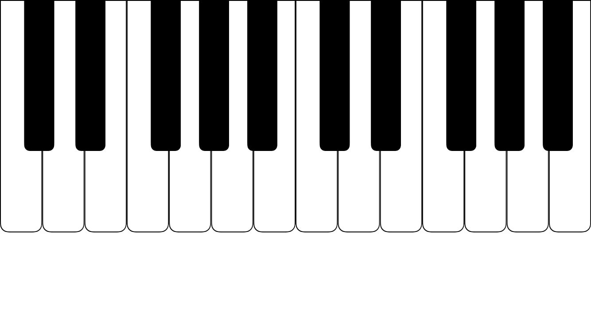

## PianoKeyboard


*Updated 16/04/2018 for Swift 4.1, because apparently some people still use this.  If you're making a music app in Swift and you're not using AudioKit. . . why not? AudioKit's AKKeyboardView (which has inherited some of its multi-touch logic from here) is what I'd probably use these days.  But this is still here, if anyone wants to go frame-work free.*

PianoKeyboard is a basic touch piano keyboard wrtten in Swift that can be used in iOS music apps. It is light-weight, and its behaviour can be easily customized either in code or through Storyboard with @IBInspectables. 

 It will respond to both new touches and touches that move from one key to another.  In polyphonic mode it will allow as many pressed keys as you have fingers. In monophonic mode it will automatically release the previously pressed key when a new key is pressed.  When a key is released in monophonic mode and other touches remain on the keyboard, it will play the note for the highest detected touch.  In both modes, pressed and released keys trigger noteOn and noteOff methods in PianoDelegate conforming class.
 
#### Using PianoKeyboard 
To use PianoKeyboard in your project, make sure to:


1. include both **Keyboard.swift** and **PianoKey.swift** in your project
2. designate a class to conform to ```PianoDelegate```
3. implement PianoDelegate's ```noteOn``` and ```noteOff``` methods 
4. instantiate a **Keyboard** view either programatically or in StoryBoard, and set its delegate

The Keyboard class itself does not make any sound - you will need to connect it to something which generates sound.  Please look at the sample project which uses AVAudioUnitSampler's default synth as an example.

#### In StoryBoard you can set/customize:
* Mono and Poly modes (*isPolyphonic*)
* Number of keys displayed (*numWhiteKeys*)
* Register (*octave*)
* Relative size of the black keys (*blackKeyHeightRatio*)

You can also change which note the keyboard starts with (it is C by default) by changing the *lowestWhiteNote* property.  For example:


    myKeyboard.lowestWhiteNote = .G

#### Licence
Using an MIT License.  Enjoy.
